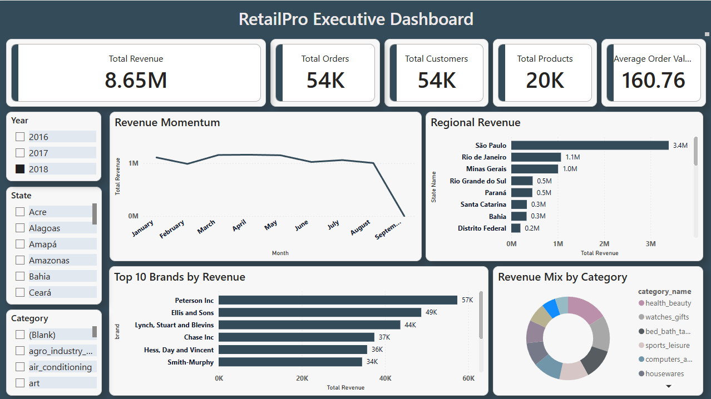
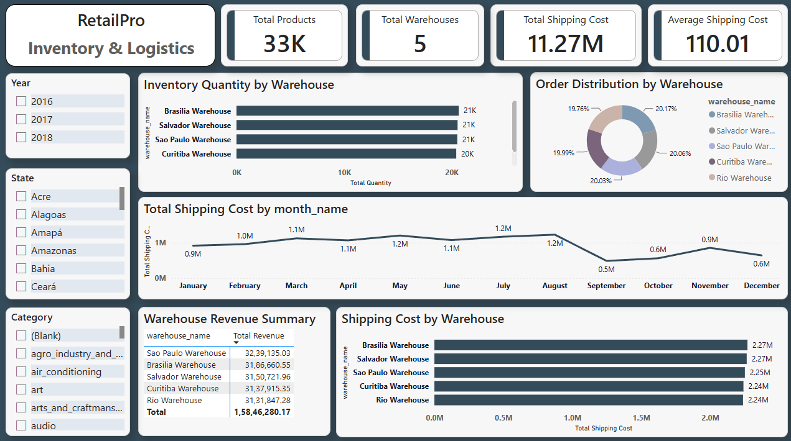
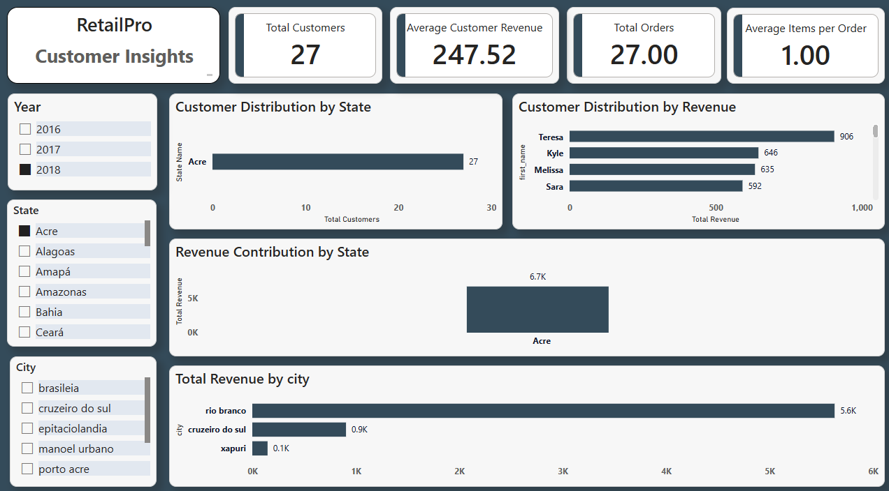

# Retail Performance Intelligence Dashboard (RetailSphere)

A 4-page Power BI report analyzing retail revenue, orders, inventory/logistics and customers.

## Pages
1. **Executive Dashboard:** KPIs (Customers, Orders, Products, Total Revenue, Avg Order Value), revenue trend, regional revenue, top 10 brands, revenue by category.
2. **Sales Analytics:** Revenue by category, top 10 suppliers, monthly trend, revenue by warehouse.
3. **Inventory & Logistics:** Quantity and orders by warehouse, shipping cost analysis.
4. **Customer Insights:** Customers by state, revenue by state/city, average customer revenue, items per order.

## Data Model
Star schema with one fact table (`fact_sales`) and five dimensions: `dim_date`, `dim_customer`, `dim_product`, `dim_supplier`, `dim_warehouse`.

## Key Measures
Total Revenue, Average Order Value, Orders Count, Total Shipping Cost, Average Customer Revenue, Average Items per Order. <!-- add the actual DAX if you want -->

## Data Source
<!-- Fill in: where the data came from (public dataset, generated, etc.) -->

## Screenshots

## How to Open
Download the `.pbix` file and open it with Power BI Desktop (Windows).
